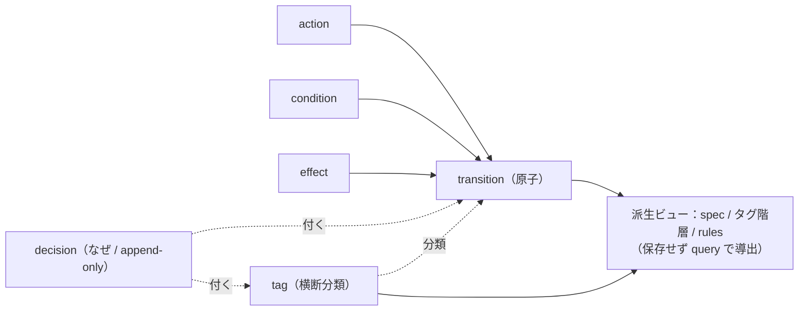
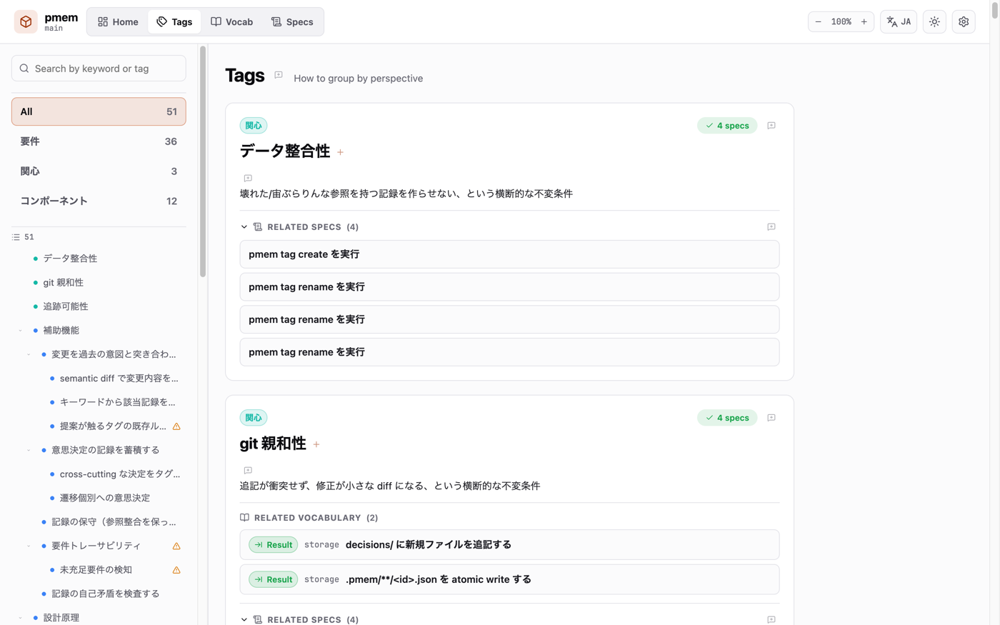
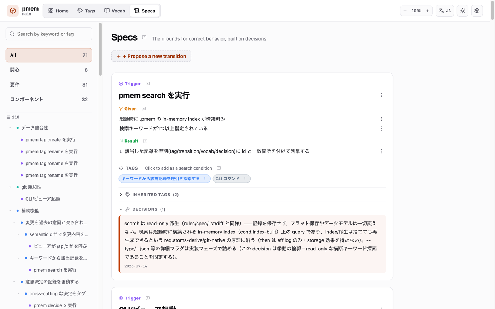
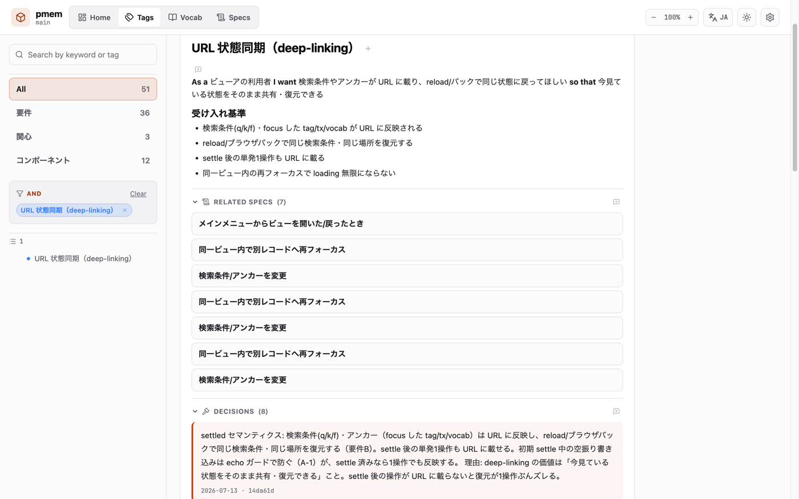
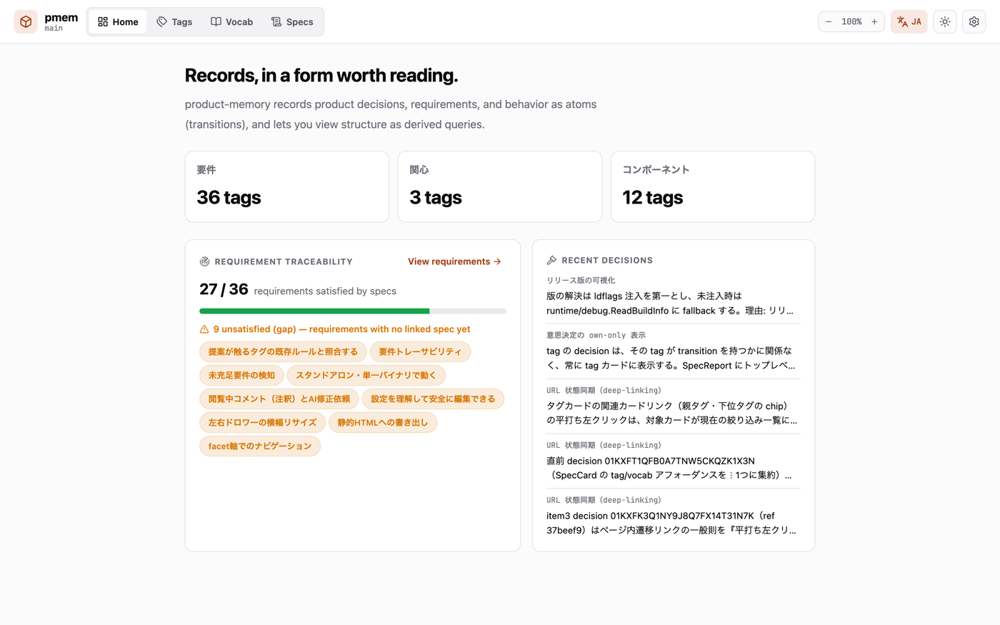

# product-memory (`pmem`)

**プロダクトの意思決定（decision）とその理由（why）を、実装の変更と結びつけて蓄積し、あとから評価するための土台。**

`pmem` は、コンポーネントやフローの詳細な振る舞いを、自由記述ではなく**語彙の組み合わせ**として記録する CLI ツールである。
コードやテストには「何をどう作ったか」は残るが、「なぜその設計にしたか」は揮発しやすい。
AI との協働や長期の継続開発では、この why の消失がとくに痛い。
過去の判断が読めないと、レビュー指摘を場当たりに直して以前の決定と矛盾させたり、同じ議論を何度も蒸し返したりする。

`pmem` は、テストやレビューを置き換えない。
その上に「決定と仕様の文脈層」を一枚足し、次の作業（人でも AI でも）が読み込んで守れる規則にする。
記録はすべて対象リポジトリ内の素の JSON として残り、コードと同じ版で git 管理される。
閲覧用のビューアは単一バイナリに同梱されるため、追加のランタイムやデータベースは要らない。

> 本ファイルはレビュー用の日本語ドラフトである。英語版 README は、この内容が固まってから作成する。

## コンセプト

`pmem` の設計は、次の中核原理から導かれる（各原理の理由は why ドキュメントで展開する）。

- **原子だけを保存し、構造は派生させる**：保存するのは遷移（transition）という原子だけ。仕様や階層、グルーピングはタグとクエリから導出する。
- **3 軸で分類する**：カテゴリ（固定）、kind（プロジェクトが宣言）、タグ（自由でネスト可能な横断分類）の 3 軸に絞る。
- **git をデータベースにする**：1 レコードが 1 テキストファイル。履歴も差分もレビューも、専用 DB でなく git のまま回る。
- **意思決定は append-only**：decision は消さず直さず、訂正は 1 件足す。凍結された判断が、変更を評価する基準になる。
- **語彙とタグは直交する**：語彙（vocab）は振る舞いを組み立て、タグ（tag）は分類する（tags classify; vocab composes.）。

保存する原子と、そこから導出される派生ビューの関係を、次の図に示す。



各原理を「なぜそう決めたか」まで掘り下げた設計判断は、「[なぜ product-memory か](docs/why-pmem.ja.md)」で展開する。
実際の記録がどう見えるかは、下記クイックスタートの `pmem spec` や `pmem view` で手元で確認できる。

## インストール

Go がある環境なら `go install` で入る。

```sh
go install github.com/nkenji09/product-memory/cmd/pmem@latest
```

プレビルドのバイナリ（darwin/linux/windows × amd64/arm64）は GitHub Releases から入手できる。
ビューアの SPA はバイナリに `//go:embed` で焼き込まれているため、`pmem` 1 つで CLI とビューアの両方が動く。

## クイックスタート

`.pmem/` を作り、語彙とタグと遷移を 1 つずつ足して、意思決定を記録するまでの最小の流れを示す。

```sh
# 1. プロジェクトに .pmem/ を作る
pmem init

# 2. 語彙（action / condition / effect）を足す
pmem vocab add action    act.user.submit-login   --label "ログイン送信" --kind user
pmem vocab add condition cond.credentials-valid  --label "資格情報が正当"
pmem vocab add effect    eff.session.issue-token --label "セッショントークン発行" --kind state --owner server

# 3. 横断分類のタグを足す
pmem tag create subject.auth --name "認証" --kind subject

# 4. 遷移（原子）を足す：WHEN ログイン送信 GIVEN 資格情報が正当 THEN トークン発行
pmem tx add T-login-submit-valid \
  --action act.user.submit-login \
  --given  cond.credentials-valid \
  --then   eff.session.issue-token \
  --tags   subject.auth

# 5. 意思決定（why）を記録する（append-only）
pmem decide --on transition:T-login-submit-valid \
  --why "トークンは httpOnly cookie で発行（XSS 対策）" --ref "PR#42"

# 6. 記録が自己矛盾していないか検査する
pmem lint

# 7. 主題タグで束ねた"仕様"レポートを見る（派生ビュー）
pmem spec subject.auth
```

手順 7 は、次のような派生レポートを表示する。

```
# 認証 (subject.auth)

## T-login-submit-valid
WHEN ログイン送信 GIVEN 資格情報が正当 THEN セッショントークン発行
decisions:
  - トークンは httpOnly cookie で発行（XSS 対策） (PR#42)
```

ブラウザで閲覧し評価するには、ローカルビューアを起動する。

```sh
pmem view   # http://127.0.0.1:4577 で開く
```

ビューアは、タグ階層のナビ、要件トレーサビリティ、そして未コミットの変更を過去の decision と突き合わせる評価ドロワーを備える。

## スクリーンショット

本リポジトリ自身の `.pmem/` レコード（dogfooding）に対してビューアを動かした画面。

| | |
|---|---|
|  タグのインデックスツリー（要件・関心・コンポーネントのカテゴリで分類） |  遷移の仕様カード（trigger・given・result・タグ・付随する decision） |
|  要件タグのユーザーストーリー・関連仕様・積み上がった意思決定 |  ホーム（要件トレーサビリティと直近の意思決定を一目で） |

## レコードは CLI 経由で書く

`.pmem/` のファイルを直接エディタで書き換えない。
`pmem` が読み取りから書き込みまでを一貫して行い、正規化と不変条件チェック、decision の append-only 保証を担う。
手で書くとこの保証が崩れ、記録の信頼性が失われる。

## AI エージェント向け

`pmem rules` で「守るべき規則」を、`pmem decision list` で過去の判断を、機械可読な形で引ける。
`pmem show vocab <id>` は、その語彙を参照している遷移を逆引きする（安全にリファクタするための、真の影響集合）。
Claude 向けのスキル（`agents/skills/pmem/`）も同梱する。

## ライセンス

MIT License. [LICENSE](LICENSE) を参照。
