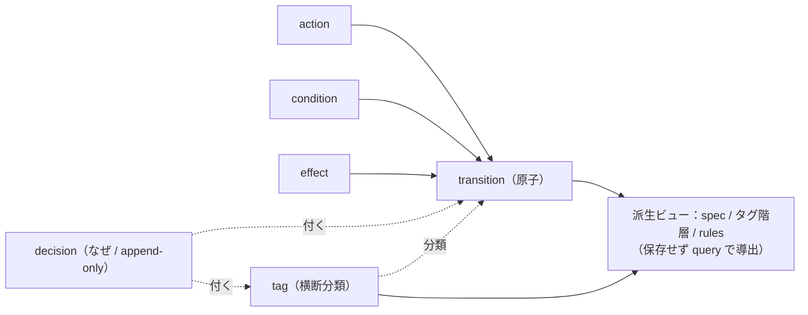
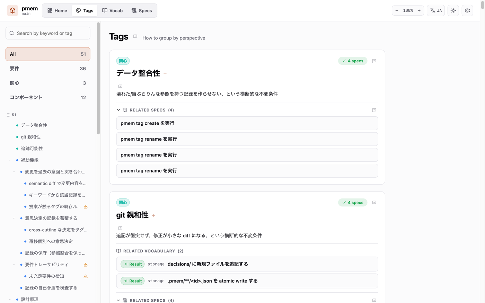
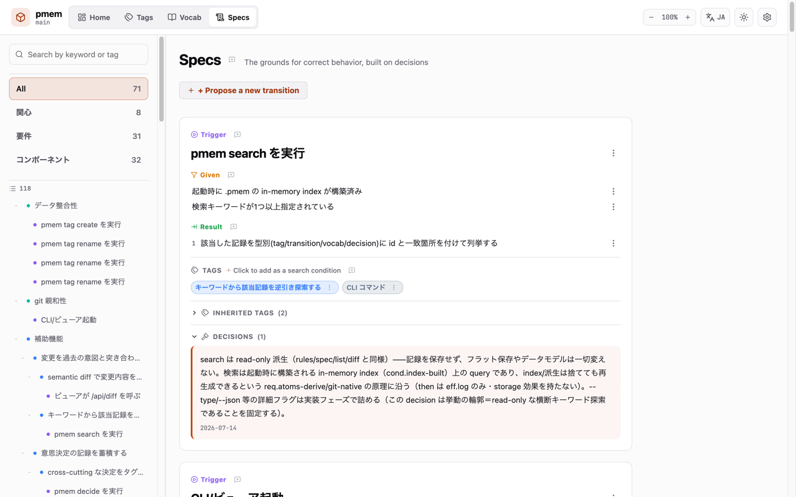
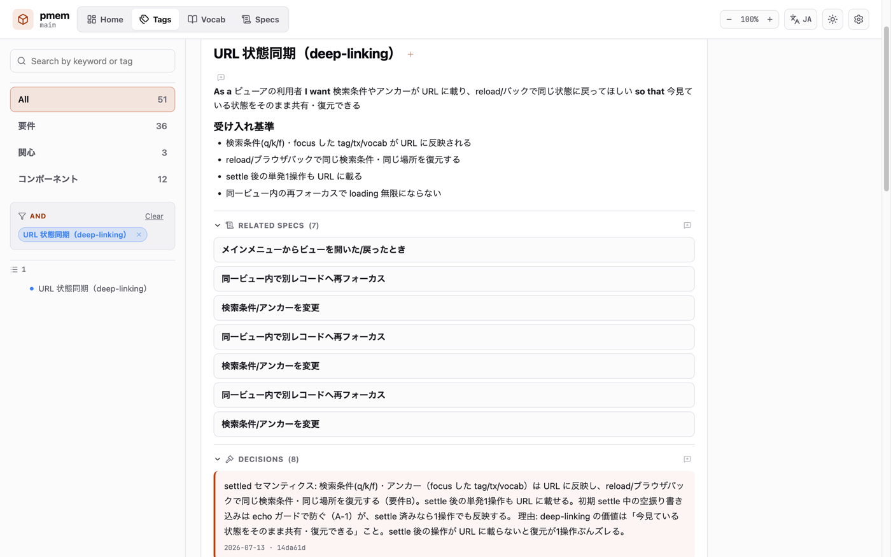
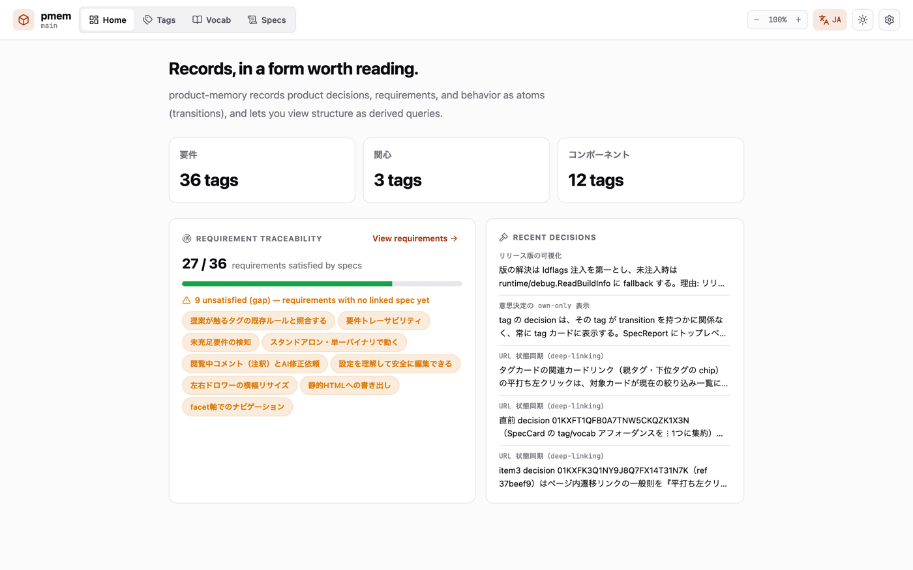

# scholia

**プロダクトの意思決定（decision）とその理由（why）を、実装の変更と結びつけて蓄積し、あとから評価するための土台。**

`scholia` は、コンポーネントやフローの詳細な振る舞いを、自由記述ではなく**語彙の組み合わせ**として記録する CLI ツールである。
コードやテストには「何をどう作ったか」は残るが、「なぜその設計にしたか」は揮発しやすい。
AI との協働や長期の継続開発では、この why の消失がとくに痛い。
過去の判断が読めないと、レビュー指摘を場当たりに直して以前の決定と矛盾させたり、同じ議論を何度も蒸し返したりする。

`scholia` は、テストやレビューを置き換えない。
その上に「決定と仕様の文脈層」を一枚足し、次の作業（人でも AI でも）が読み込んで守れる規則にする。
記録はすべて対象リポジトリ内の素の JSON として残り、コードと同じ版で git 管理される。
閲覧用のビューアは単一バイナリに同梱されるため、追加のランタイムやデータベースは要らない。

## コンセプト

`scholia` の設計は、次の中核原理から導かれる（各原理の理由は why ドキュメントで展開する）。

- **原子だけを保存し、構造は派生させる**：保存するのは遷移（transition）という原子だけ。仕様や階層、グルーピングはタグとクエリから導出する。
- **3 軸で分類する**：カテゴリ（固定）、kind（プロジェクトが宣言）、タグ（自由でネスト可能な横断分類）の 3 軸に絞る。
- **git をデータベースにする**：1 レコードが 1 テキストファイル。履歴も差分もレビューも、専用 DB でなく git のまま回る。
- **意思決定は append-only**：decision は消さず直さず、訂正は 1 件足す。訂正は元の decision を「置き換える／部分改訂する／例外とする」（`supersedes`）と機械可読に宣言できるので、「今どれが正か」も辿れる。凍結された判断が、変更を評価する基準になる。
- **語彙とタグは直交する**：語彙（vocab）は振る舞いを組み立て、タグ（tag）は分類する（tags classify; vocab composes.）。

保存する原子と、そこから導出される派生ビューの関係を、次の図に示す。


```mermaid
flowchart LR
    act["action"] --> tx["transition（原子）"]
    cond["condition"] --> tx
    eff["effect"] --> tx
    tag["tag（横断分類）"] -. 分類 .-> tx
    dec["decision（なぜ / append-only）"] -. 付く .-> tx
    dec -. 付く .-> tag
    tx --> q["派生ビュー：spec / タグ階層 / rules<br/>（保存せず query で導出）"]
    tag --> q
```

各原理を「なぜそう決めたか」まで掘り下げた設計判断は、「[なぜ scholia か](docs/why-scholia.ja.md)」で展開する。
実際の記録がどう見えるかは、下記クイックスタートの `scholia spec` や `scholia view` で手元で確認できる。

## インストール

クイックインストール（darwin/linux）：最新リリースを取得して `scholia` バイナリを入れる。

```sh
curl -fsSL https://raw.githubusercontent.com/nkenji09/scholia/main/packaging/install.sh | sh
```

`$SCHOLIA_INSTALL_DIR`（既定: `~/.local/bin`）配下に入る。PATH に無ければ追加すること。

Go がある環境なら `go install` でも入る。

```sh
go install github.com/nkenji09/scholia/cmd/scholia@latest
```

プレビルドのバイナリ（darwin/linux/windows × amd64/arm64）も GitHub Releases から入手できる（Windows は `go install` かリリース zip を利用）。
ビューアの SPA はバイナリに `//go:embed` で焼き込まれているため、`scholia` 1 つで CLI とビューアの両方が動く。

## クイックスタート

`.scholia/` を作り、語彙とタグと遷移を 1 つずつ足して、意思決定を記録するまでの最小の流れを示す。

```sh
# 1. プロジェクトに .scholia/ を作る
scholia init

# 2. 語彙（action / condition / effect）を足す
scholia vocab add action    act.user.submit-login   --label "ログイン送信" --kind user
scholia vocab add condition cond.credentials-valid  --label "資格情報が正当"
scholia vocab add effect    eff.session.issue-token --label "セッショントークン発行" --kind state --owner server

# 3. 横断分類のタグを足す
scholia tag create subject.auth --name "認証" --kind subject

# 4. 遷移（原子）を足す：WHEN ログイン送信 GIVEN 資格情報が正当 THEN トークン発行
scholia tx add T-login-submit-valid \
  --action act.user.submit-login \
  --given  cond.credentials-valid \
  --then   eff.session.issue-token \
  --tags   subject.auth

# 5. 意思決定（why）を記録する（append-only）
scholia decide --on transition:T-login-submit-valid \
  --why "トークンは httpOnly cookie で発行（XSS 対策）" --ref "PR#42"

# 6. 記録が自己矛盾していないか検査する
scholia lint

# 7. 主題タグで束ねた"仕様"レポートを見る（派生ビュー）
scholia spec subject.auth
```

手順 7 は、次のような派生レポートを表示する。

```
# 認証 (subject.auth)

## T-login-submit-valid
WHEN ログイン送信 GIVEN 資格情報が正当 THEN セッショントークン発行
decisions:
  - トークンは httpOnly cookie で発行（XSS 対策） (PR#42)
```

ブラウザで閲覧し評価するには、ローカルビューアを起動する。

```sh
scholia view   # http://127.0.0.1:4577 で開く
```

ビューアは、タグ階層のナビ、要件トレーサビリティ、そして未コミットの変更を過去の decision と突き合わせる評価ドロワーを備える。

## スクリーンショット

本リポジトリ自身の `.scholia/` レコード（dogfooding）に対してビューアを動かした画面。

| | |
|---|---|
|  タグのインデックスツリー（要件・関心・コンポーネントのカテゴリで分類） |  遷移の仕様カード（trigger・given・result・タグ・付随する decision） |
|  要件タグのユーザーストーリー・関連仕様・積み上がった意思決定 |  ホーム（要件トレーサビリティと直近の意思決定を一目で） |

## レコードは CLI 経由で書く

`.scholia/` のファイルを直接エディタで書き換えない。
`scholia` が読み取りから書き込みまでを一貫して行い、正規化と不変条件チェック、decision の append-only 保証を担う。
手で書くとこの保証が崩れ、記録の信頼性が失われる。

## 基本を超えて

記録が増えてくると、それを腐らせないための機構がいくつか効いてくる。

- **容認の型付き宣言**：`scholia decide --acknowledges <ruleId>` は、lint や flow の finding を「意図的に確認済みの gap」として、対象の rule id に紐づけて記録する。無関係な decision がたまたま実在の gap を隠してしまう事故を防ぐ。
- **重なる遷移の評価順**：`scholia tx add/edit --priority <n>` で、同じケースに複数の遷移が当てはまりうるときどれが勝つかを宣言できる。`scholia flow`/`scholia gaps` はこれをもとに重なりを「未定義」のまま報告せず解決済みとして畳める。
- **語彙の出自**：`scholia vocab add/edit --ref --alt-label --establishes` で、その語彙がどこから来て何の状態を確立するのかを記録できる。`scholia show vocab <id>` は使用箇所と出自の両方を逆引きする。
- **CI での強制**：`scholia lint --ci` は warn の baseline（`scholia lint baseline update`）に対する歯止めを、`scholia diff --check` は decision の append-only 保証を CI で検査する。
- **既存リポジトリの導入支援**：`scholia retrofit` は advisory 規則の違反を read-only で棚卸しし、`scholia config infer-id-policy` は既存の id 分布から命名規約の宣言案を出す。

詳しいフラグは `scholia <command> --help`、内部モデルは [DESIGN.md](DESIGN.md) を参照。

## AI エージェント向け

`scholia rules` で「守るべき規則」を、`scholia decision list` で過去の判断を、機械可読な形で引ける。
`scholia show vocab <id>` は、その語彙を参照している遷移を逆引きする（安全にリファクタするための、真の影響集合）。
`scholia rules` と `scholia spec` は、いま効いている規則だけを出す。取り下げられた（supersede された）decision は黙って消えるのではなく、**存在とどこへ置き換わったかが出力に残り**、全文は `--all` で読める。`scholia search` は何も畳まない——取り下げ済みのヒットに印を付けるので、取り下げた記録にも辿り着ける。JSON はどの面でも `effect`（`in-force` / `replaced`）を持つので、消費側が逆リンクを組み直さなくても効力が分かる。`scholia decision list --unlinked` は commit がまだ結線されていない decision を洗い出す（フォローアップの棚卸しに使える）。

Claude Code 向けのスキル（`scholia` / `scholia-change` / `scholia-triage` / `scholia-config-setup`）を `agents/skills/` に同梱している。導入経路は 2 つある。

**A. Claude Code プラグインとして（Claude Code 利用者に推奨）。** このリポジトリをプラグインマーケットプレイスとして追加し、`scholia` プラグインをインストールする。スキルは `/scholia:scholia`・`/scholia:scholia-change` のように名前空間化される。

```
/plugin marketplace add nkenji09/scholia
/plugin install scholia@scholia
```

**B. CLI から（`scholia skills install`）。** バイナリに焼き込んだ同じスキルを `.claude/skills/` へ展開する（マーケットプレイス不要）。CI・スタンドアロン環境や、`go install` で `scholia` を入れてプラグイン経由を使わずリポジトリ内にスキルを展開したいときに使う。

```sh
scholia skills install            # <cwd>/.claude/skills/ へ（既定）
scholia skills install --user     # ~/.claude/skills/ へ
```

どちらも**単一ソース**（`agents/skills/`）を配布する。プラグインはマーケットプレイス経由で、`scholia skills install` はバイナリの `//go:embed` 由来で、同じスキルを届ける。スキル（`agents/` 配下）に変更を含むリリースでは、プラグイン版（`agents/.claude-plugin/plugin.json`）の version をそのリリースタグに揃える（詳細は [RELEASING.md](RELEASING.md)）。

**別 repo のスキルから scholia の共有リファレンスを読ませたいときは、パスではなくコマンドを置く。**

```sh
scholia skills ls                             # 参照できる文書の名前を一覧
scholia skills show modeling-principles       # 全文を stdout へ（ディスクには書かない）
scholia skills show scholia-change/SKILL.md   # 短縮名が衝突する SKILL.md はパスで指定
```

自分のリポジトリに置いたスキルから scholia 側の文書を参照するとき、パスの直書きは腐る（プラグイン実体のパスはバージョンを含み、`skills install` 先も `--project`／`--user` で変わる）。`scholia skills show` を手順として置けば、cwd もバージョンも問わず同じ形で読める。

## ライセンス

MIT License. [LICENSE](LICENSE) を参照。
