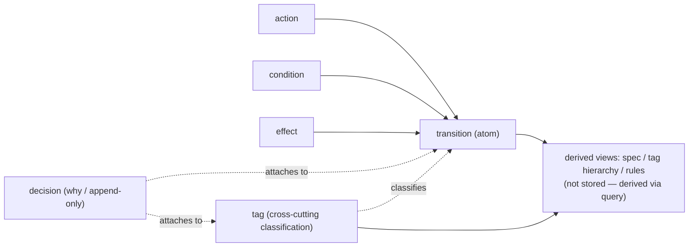

# scholia

[](https://github.com/nkenji09/scholia/actions/workflows/test.yml)

**A foundation for accumulating product decisions and their reasoning (why), linked to implementation changes, so they can be evaluated later.**

`scholia` is a CLI tool that records the detailed behavior of components and flows not as free-form text, but as **combinations of a controlled vocabulary**.

Code and tests preserve *what* was built and *how*, but *why* a given design was chosen tends to evaporate.
When collaborating with AI or working on a long-lived codebase, this loss of "why" is especially painful.
Without a readable record of past decisions, review comments get patched ad hoc — contradicting earlier decisions — and the same arguments get relitigated over and over.

`scholia` does not replace tests or reviews.
It adds one layer on top — a context layer of decisions and specs — and turns it into rules that the next round of work (human or AI) can read and follow.
All records are stored as plain JSON inside the target repository and are versioned in git alongside the code.
The viewer for browsing them ships as a single binary, so no extra runtime or database is required.

## Concept

`scholia`'s design follows from these core principles (the reasoning behind each is expanded in the why document):

- **Store only atoms; derive structure.** The only thing stored is the transition — an atom. Specs, hierarchies, and groupings are all derived from tags and queries.
- **Classify along three axes.** Category (fixed), kind (declared per project), and tag (free-form, nestable, cross-cutting classification) — nothing more.
- **Let git be the database.** One record, one text file. History, diffs, and review all run on plain git — no dedicated database needed.
- **Decisions are append-only.** A decision is never deleted or edited; a correction is added as a new entry. Frozen judgments become the baseline against which future changes are evaluated.
- **Vocabulary and tags are orthogonal.** Vocabulary (vocab) composes behavior; tags classify it (tags classify; vocab composes).

The diagram below shows the relationship between the atoms that get stored and the derived views built from them.



Design decisions that dig into "why" for each principle are expanded in [Why scholia](docs/why-scholia.ja.md) (Japanese).
To see what an actual record looks like, try `scholia spec` and `scholia view` from the quickstart below.

## Installation

Quick install (darwin/linux) — downloads the latest release and installs the `scholia` binary:

```sh
curl -fsSL https://raw.githubusercontent.com/nkenji09/scholia/main/packaging/install.sh | sh
```

This installs into `$SCHOLIA_INSTALL_DIR` (default: `~/.local/bin`); add it to your `PATH` if it isn't already.

If you have Go, `go install` works instead:

```sh
go install github.com/nkenji09/scholia/cmd/scholia@latest
```

Prebuilt binaries (darwin/linux/windows × amd64/arm64) are also available from GitHub Releases — on Windows, use `go install` or grab the release zip directly.
The viewer SPA is embedded into the binary via `//go:embed`, so a single `scholia` binary runs both the CLI and the viewer.

## Updating

If you installed a release binary (via `install.sh` or a manual download) on darwin/linux, `scholia` can update itself in place:

```sh
scholia update            # download latest release, verify checksum, replace the running binary
scholia update --check    # report whether an update is available, without downloading or replacing
```

Other install methods update the same way you installed:

```sh
go install github.com/nkenji09/scholia/cmd/scholia@latest   # go install
npm i -g scholia@latest                                  # npm
curl -fsSL https://raw.githubusercontent.com/nkenji09/scholia/main/packaging/install.sh | sh  # install.sh, re-run
```

On Windows, `scholia update` reports that self-replace isn't possible and points to the same options above.

## Quickstart

This walks through the minimal flow: create `.scholia/`, add vocabulary, tags, and a transition one at a time, and record a decision.

```sh
# 1. Create .scholia/ in your project
scholia init

# 2. Add vocabulary (action / condition / effect)
scholia vocab add action    act.user.submit-login   --label "Submit login" --kind user
scholia vocab add condition cond.credentials-valid  --label "Credentials are valid"
scholia vocab add effect    eff.session.issue-token --label "Issue session token" --kind state --owner server

# 3. Add a cross-cutting classification tag
scholia tag create subject.auth --name "Authentication" --kind subject

# 4. Add a transition (atom): WHEN submit login GIVEN credentials valid THEN issue token
scholia tx add T-login-submit-valid \
  --action act.user.submit-login \
  --given  cond.credentials-valid \
  --then   eff.session.issue-token \
  --tags   subject.auth

# 5. Record a decision (why) — append-only
scholia decide --on transition:T-login-submit-valid \
  --why "Issue the token as an httpOnly cookie (XSS mitigation)" --ref "PR#42"

# 6. Check the records for self-contradiction
scholia lint

# 7. View the "spec" report grouped by subject tag (derived view)
scholia spec subject.auth
```

Step 7 renders a derived report like this:

```
# Authentication (subject.auth)

## T-login-submit-valid
WHEN Submit login GIVEN Credentials are valid THEN Issue session token
decisions:
  - Issue the token as an httpOnly cookie (XSS mitigation) (PR#42)
```

To browse and evaluate records in a browser, start the local viewer.

```sh
scholia view   # opens at http://127.0.0.1:4577
```

The viewer includes tag-hierarchy navigation, requirement traceability, and an evaluation drawer that checks uncommitted changes against past decisions.

## Screenshots

The viewer running against this repository's own `.scholia/` records (dogfooding).

| | |
|---|---|
|  Tag index tree, grouped by category (requirement / concern / component) |  A transition spec card — trigger, given, result, tags, and its decision |
|  A requirement tag's user story, related specs, and accumulated decisions |  Home — requirement traceability and recent decisions at a glance |

## Records are written through the CLI

Don't edit files under `.scholia/` directly in a text editor.
`scholia` handles reads and writes consistently, enforcing normalization, invariant checks, and the append-only guarantee on decisions.
Writing by hand breaks these guarantees and undermines the reliability of the records.

## For AI agents

`scholia rules` surfaces the rules to follow, and `scholia decision list` surfaces past judgments, both in machine-readable form.
`scholia show vocab <id>` reverse-looks-up the transitions that reference a given vocabulary entry — the true impact set for a safe refactor.

Claude Code skills (`scholia` / `scholia-change` / `scholia-triage` / `scholia-config-setup`) are bundled under `agents/skills/`, and there are two ways to install them:

**A. As a Claude Code plugin (recommended for Claude Code users).** Add this repository as a plugin marketplace and install the `scholia` plugin. The skills are then namespaced as `/scholia:scholia`, `/scholia:scholia-change`, etc.

```
/plugin marketplace add nkenji09/scholia
/plugin install scholia@scholia
```

**B. Via the CLI (`scholia skills install`).** Unpacks the same skills into `.claude/skills/` from the embedded copy in the binary — no marketplace needed. Handy for CI, standalone environments, or when you install `scholia` via `go install` and want the skills materialized in-repo without going through the plugin flow.

```sh
scholia skills install            # into <cwd>/.claude/skills/ (default)
scholia skills install --user     # into ~/.claude/skills/
```

Both paths ship the **same single source** (`agents/skills/`); the plugin serves it via the marketplace, while `scholia skills install` serves it from the binary's `//go:embed` copy. For releases that include skill changes (`agents/`), the plugin version (`agents/.claude-plugin/plugin.json`) is kept in sync with the release tag (see [RELEASING.md](RELEASING.md)).

## License

MIT License. See [LICENSE](LICENSE).
