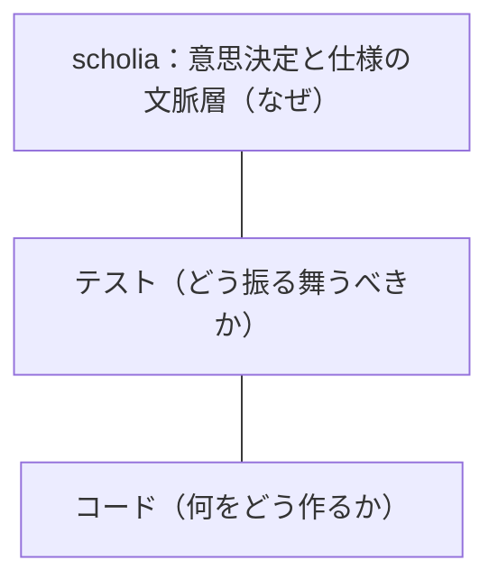
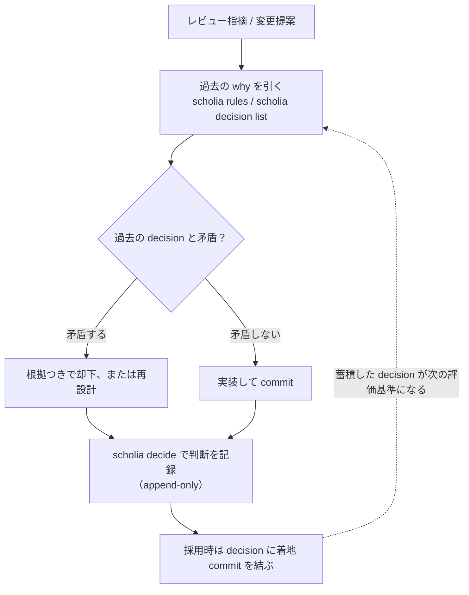

# なぜ scholia か

`scholia` を検討している開発者に向けて、このツールが解く問題と、その設計判断の筋を示す。

## 問題意識：意思決定と理由が揮発する

ソフトウェアの中身は、コードとテストによく残る。
残らないのは「なぜその設計にしたか」である。

コードは「何をどう作ったか」を記述し、テストは「どう振る舞うべきか」を固定する。
どちらも、その形に至った判断の理由（why）までは書かない。
だからリポジトリを読み返しても、ある実装が「検討の末にこう決めた」のか「たまたまそうなった」のかは区別できない。

この揮発は、AI との協働や長期の継続開発でとくに痛む。
過去の判断が読めないと、次の 3 つの失敗が起きやすい。

1. **レビュー指摘への場当たり対応**：指摘された箇所だけを直すと、以前に別の箇所で下した決定と食い違うことがある。過去の why が手元になければ、この矛盾に気づけないまま「モグラ叩き」を続けてしまう。
2. **同じ議論の蒸し返し**：「この振る舞いは以前に検討して却下した」という記録がないと、同じ提案が繰り返し持ち込まれ、そのたびに一から議論し直す。
3. **仕様がファイル分割の判断に埋もれる**：仕様を「どのファイルに、どの粒度で書くか」という整理の判断と混ぜると、仕様そのものより整理の都合が前に出る。どこに何が書いてあるかを追うだけで消耗する。

`scholia` は、この 3 つの痛みを、意思決定を明示的なレコードとして残すことで和らげる。
テストやレビューを置き換えるのではなく、その上に why の層を一枚足す。
コードとテストの上に why の層を重ねる関係を、次の図に示す。



## 人間にとって嬉しいこと

**利点は、記録が腐らないこと、変更を過去に照らして評価できること、整理の判断から解放されることの 3 つに集約できる。**

まず、記録が腐らない。
decision は append-only である。
一度記録した判断は消さず、直さない。
訂正が要るときは、新しい 1 件を足す。
だから半年後に読んでも、そのとき何をどういう理由で決めたかが、書き換わらずに残っている。

この凍結された記録が、変更を評価する基準になる。
レビュー指摘や仕様変更が来たとき、それを過去の decision に照らして「本当に取り込むべきか」を判断できる。
過去の判断と矛盾する変更は、却下する根拠がその場で揃う。
言われるがまま直すのではなく、筋を通して受け入れるか断るかを選べる。
変更提案が来てから decision に着地するまでの流れを、次の図に示す。



却下も採用も、どちらも append-only の decision として残る。
だから同じ提案が次に来ても、過去の判断を根拠に即座にさばける。

残りの利点は、整理の負担が消えることである。

- **整理の判断が要らない**：仕様やグルーピングは原子から自動で導出される。主題タグを付けるだけで、その主題の"仕様"レポートが `scholia spec` で描かれる。1 つの振る舞いに複数のタグを付けてよいので、「1 か所にしか置けない」制約からも解放される。
- **横断して眺められる**：ビューアはカテゴリや kind、コンポーネント別のタグ階層で絞り込みながら、遷移とその decision を並べて見せる。未コミットの変更を過去の decision と突き合わせる評価ドロワーもある。

## AI にとって嬉しいこと

**AI エージェントにとって、`scholia` の記録は「読むだけで過去の意図がわかる」機械可読なコンテキストになる。**

- **過去の why を機械可読に引ける**：`scholia rules` が守るべき規則を、`scholia decision list` が過去の判断を返す。作業の前にこれを読み込めば、過去の意図に沿って動ける。散文を要約させる必要がない。
- **変更を過去と突き合わせられる**：新しい提案が既存の decision と衝突するかを id 単位で照合できる。「この提案は以前に却下済み」という判定が、根拠つきで即座に出る。
- **リファクタの影響範囲が確定する**：`scholia show vocab <id>` が、その語彙を参照している遷移をすべて逆引きする。これが「真の影響集合」であり、当て推量でなく実データに基づいて変更範囲を決められる。
- **構造が壊れにくい**：カテゴリの 3 軸は固定で、kind は宣言制である。新しい kind を足すことはスキーマ変更であり、diff に現れる。だから、エージェントが勝手に分類軸を増やして構造を溶かす、という事故が起きにくい。

## なぜコードベースに保存するのか

仕様と decision を、GitHub Issue やバックログではなく、リポジトリの中に置く。
これは保存場所についての設計判断であり、一番の理由は検索性である。

**機械可読な JSON がリポジトリの中にあるからこそ、AI も人も、関連する意思決定と仕様を CLI でその場で検索し、逆引きできる。**

`scholia rules` で対象の守るべき規則を引き、`scholia show vocab` で語彙の使用箇所を逆引きし、さらに素の `grep` でも `.scholia/` を横断できる。
外部トラッカーの API を叩く必要はない。
探したいコンテキストが、コードと同じ場所、同じ作業ツリーの中にある。
引いた記録を AI が実際にどう使うかは、「AI にとって嬉しいこと」で述べたとおりである。

保存場所をコードベースにすると、この検索性に加えて次も同時に手に入る。

- **変更と同じ版で動く**：仕様と decision が、実装と同じ commit / PR / diff に乗る。「この変更で仕様がこう変わった」が 1 つの diff で見える。Issue は別の場所にあり、コード変更と機械的には結びつかない（リンクは切れ、古くなる）。
- **ブランチと一緒に動く**：feature ブランチで仕様も一緒に変わり、マージで一緒に入る。どの版に対する仕様かが常に一意に決まる。トラッカーはブランチをまたいで 1 つなので、版との対応が曖昧になる。
- **同じレビューに乗る**：仕様の変更が PR の diff に現れるので、コードと同じ承認プロセスでレビューできる。外部トラッカーのコメントは、コードレビューの外にある。
- **外部ツールに依存しない**：リポジトリだけで完結する。オフラインでも、別ホスティングに移しても、年月が経っても残る。外部 SaaS の寿命やエクスポート事情に縛られない。
- **git がそのまま履歴になる**：誰がいつ何を決めたかが `git log` / `git blame` でわかる。append-only の decision と git 履歴が二重に効く。

ただし、これは Issue やバックログを置き換える主張ではない。
議論の場と、確定した記録の置き場は、役割が違う。

| | 向くもの |
| --- | --- |
| Issue / バックログ | これからやることの管理（議論、優先度付け、計画） |
| scholia | 決まったことと、その理由の恒久記録 |

Issue で議論し、決まったことを `scholia` に decision として残す。
この 2 つは競合せず、補い合う。

## なぜフラットなファイルとして管理するのか

コードベースに置くと決めたうえで、その中の並べ方をフラットにする。
`scholia` はレコードを 1 件 1 ファイルで、型ごとに 1 階層だけ切って、その中はフラットに並べる。
入れ子のディレクトリを作らないのは、意図的な選択である。

```
.scholia/
  vocab/        <id>.json
  tags/         <id>.json
  transitions/  <id>.json
  decisions/    <ulid>.json
```

型で 1 階層（`vocab/` `tags/` `transitions/` `decisions/`）に分け、型の中は入れ子を作らない。
ファイル名がそのまま**安定した ID** である。
タグや語彙や遷移の ID は、`req.components-formInputs-uisamplerangeinput` や `act.api.clear` のようなドット名前空間のスラグにする。
decision の ID は ULID で、append-only の不変レコードであることを表す。

### なぜディレクトリ階層にしないのか

タグは可変で、多対多である。
この 2 つの性質が、ディレクトリ階層を選べない理由になる。

| ディレクトリ階層にすると壊れるもの | 理由 |
| --- | --- |
| ID 参照の安定性 | タグの付け替えが `git mv` になり、パスが変わる。パスが ID を兼ねていると、その ID を指していた参照がすべて断絶する（decision が指す遷移も、遷移が参照する語彙も宙に浮く） |
| 多対多のタグ付け | 1 つのアイテムが複数のタグを持つとき、その実体ファイルを複数のディレクトリに同時には置けない。無理に置けば実体が重複し、どれが正かを決められなくなる |

つまりディレクトリ階層は、このツールの土台である git-as-DB と 3 軸固定と「原子＋派生」を同時に壊す。
だからフラットは、消極的な妥協ではなく、これらを守るための積極的な選択である。

### 代わりにどうするか

階層は、保存しない。
表示するときに、タグの `parentIds` から再構成する。
保存はフラットのまま、木構造はクエリで導出する。

こうすると、タグの付け替えに強くなる。
付け替えはファイルの中身（参照する ID の集合）を書き換えるだけで済み、パスは動かない。
ID が動かないから、参照も断絶しない。

### フラットの弱点にどう答えるか

フラットな配置には、命名の衝突とスケールという定番の弱点がある。
これにはドット名前空間のスラグで答える。

`req.components-formInputs-uisamplerangeinput` のようなスラグは、区切りが実質の「仮想フォルダ」として働く。
物理的にはフラットでも、名前の上では階層を表現できる。
命名規約で接頭辞の付け方を揃えれば、衝突は避けられ、grep でまとまりを絞り込める。

### git-as-DB がもたらすもの

1 レコード 1 ファイルは、git をそのままデータベースにするための形でもある。

> 1 レコードが 1 ファイル。行を足す操作はファイルを足す操作で、衝突しない。行を直す操作は小さなテキスト差分で、衝突しても人が読んで直せる。

とくに decision を 1 件 1 ファイルにしているのは、追記を衝突させないためである。
配列 JSON に追記すると末尾で毎回衝突するが、ファイルを 1 つ足すだけなら衝突しない。

この形の利点は、専用のインフラを持たずに DB の恩恵を得られることである。
履歴も diff もレビューも、すべて git のワークフローで回る。
真実の源は常にファイルであり、検索用のインデックスは捨てても再生成できる派生物にすぎない。
だから `scholia` は単一バイナリで動き、外部データベースを要求しない。
